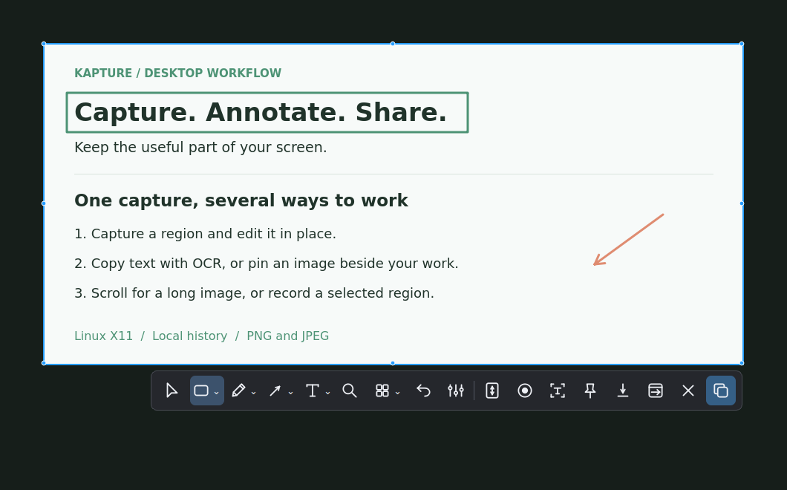
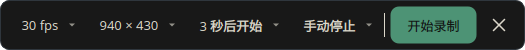

<div align="center">


# KaPin

**An open-source PixPin alternative for Linux X11**

Screenshots · Scrolling capture · OCR · Pinned images · Annotation · Recording

Capture, annotate, extract text, and keep visual references at hand in one X11 workflow.

[简体中文](README.zh-CN.md) · [Quick start](#quick-start) · [Features](#features) · [Report an issue](https://github.com/CyberAn-Dev/kapture-dev/issues)


[](LICENSE)

</div>

<div align="center">


<sub>Full editor with annotations, OCR results, and the output menu. Screenshots use sample content.</sub>

</div>

<details>
<summary>In-place editing and recording controls</summary>

<div align="center">



<sub>Resize the blue selection and annotate immediately.</sub>



<sub>Choose frame rate, resolution, countdown, and duration from dropdowns.</sub>

</div>

</details>

## A familiar capture workflow

- **Capture and explain**: every capture opens in inline editing. Select a region or window, add arrows, numbered steps, or mosaic, then copy or save; open the full editor when you need more space.
- **Get text out of images**: open a capture in the full editor for automatic OCR, select words in the image, or grab text directly from the screen.
- **Keep references beside your work**: pin clipboard images, zoom, and adjust opacity.
- **Go beyond one screen**: capture automatically or scroll manually inside a red frame, with live preview and duplicate-aware stitching.

## Features

| Tool | What it does |
| --- | --- |
| Capture | Resize the blue selection with eight handles and a pixel loupe; use grouped tools in a single-row toolbar and edit immediately in place. |
| Scrolling capture | Start a red-frame capture from the toolbar; manual and automatic up/down modes provide a live preview and duplicate-aware stitching. |
| OCR | Chinese and English recognition, word selection in images, and screen text grab; opening a capture in the full editor runs OCR by default. |
| Pin images | Keep images on top, zoom, adjust opacity, annotate with the grouped toolbar, and drag across recognized words to copy. |
| Edit and save | Undo/redo, move/delete annotations, change color/width, type directly on the canvas and double-click to edit text, crop, and save original-size PNG or JPEG images with annotations. |
| Record | Use the region-adjacent recording toolbar from inline capture or the editor. Choose frame rate, resolution, countdown, and duration; export MP4, GIF, or MKV afterwards, with progress and multiple exports. |
| History | Keep up to 10 screenshot entries with timestamps and 10 clipboard-image entries on this machine; both collections survive restarts. |
| Desktop | GNOME and KDE Plasma 5 shortcuts, themes, system tray, and background launch. |

The app has English and Simplified Chinese interfaces. OCR uses Tesseract; screen recording uses ffmpeg.

## Quick start

Use an **X11** session. The install scripts target Ubuntu or Kubuntu with `apt` and require internet access.

### From source

```bash
git clone https://github.com/CyberAn-Dev/kapture-dev.git
cd kapture-dev
bash install.sh
./run.sh
```

The installer adds system dependencies and an application-menu entry. Keep the checkout in place because the launcher uses its path.

### Optional: build a `.deb`

```bash
bash build_deb.sh 1.1.0
sudo apt install ./dist/kapture_1.1.0_all.deb
```

`1.1.0` is an example version. The package is built from the current checkout; launch with `kapture` and remove with `sudo apt remove kapture`.

Upstream [releases](https://github.com/ycwei5/kapture/releases) contain the upstream app and may not include this fork's changes.

<details>
<summary>Appearance and settings</summary>

<div align="center">


<sub>Configure shortcuts, capture behavior, OCR and recording defaults, and appearance.</sub>

</div>

GNOME restores saved KaPin shortcuts at startup. Change conflicting combinations in Settings. Background launch hides the window; it does not enable login autostart.

</details>

## Everyday controls

| Action | Key / gesture |
| --- | --- |
| Pin newest / previous clipboard image | Ctrl+1 / Ctrl+2 (GNOME defaults, configurable) |
| Zoom / adjust pin opacity | Scroll / Ctrl+scroll |
| Recognize text in a pin | O or context menu |
| Undo / redo | Ctrl+Z / Ctrl+Shift+Z |
| Delete selected annotation | Delete |
| Stop scrolling capture / close focused pin | Esc |

Captures always open in-place editing: Enter copies, Esc cancels, and **Open in editor** hands the image to the full editor. Right-click a pin to annotate or select text; restore click-through pins from the tray.

To capture KaPin itself, enable **Keep main window during capture** in **Settings → General**. Capture shortcuts also work while Settings is open and preserve unsaved changes.

Scroll speed lives in the scrolling-capture menu; screenshot delay lives in the capture menu. Recording has its own frame rate, resolution, countdown, and duration controls, followed by format selection after capture.

History stays on this machine and survives restarts: up to 10 screenshots with capture timestamps and 10 clipboard images, with a separate 40-million-pixel budget per collection; the newest image is always retained. Clear both collections from the history window.

## Command line

Run one action with `./run.sh <option>`, for example `./run.sh --region`.

- Capture: `--region`, `--window`, `--scroll`, `--manual`, `--repeat`
- Other: `--pin1`, `--pin2`, `--color`, `--record`, `--settings`, `--show`, `--background`

## How it differs from PixPin

KaPin is an independent open-source project, originally based on [Kapture](https://github.com/ycwei5/kapture), and is not affiliated with [PixPin](https://pixpin.cn/). It is a focused Linux X11 replacement for PixPin's everyday screenshot workflow: inline editing, OCR, scrolling capture, pinning, and recording are available in one app, while the overall feature set is narrower. OCR translation, QR recognition, and recording audio are not currently provided.

- X11 only; Wayland is not supported. In-app global shortcut setup is available on GNOME and KDE Plasma 5.
- Scrolling capture is limited to 40,000 pixels in height. Dynamic pages, overlays, lazy loading, and repeated content can affect alignment; it is not a browser full-page export.
- Capture coordinates across monitors with different scaling factors are not fully verified.
- OCR accuracy depends on text size, font, and image quality. Tesseract and its Chinese and English language packs must be installed.

## Contribute and license

Report issues or propose changes in [Issues](https://github.com/CyberAn-Dev/kapture-dev/issues) and [Pull Requests](https://github.com/CyberAn-Dev/kapture-dev/pulls).

Based on [ycwei5/kapture](https://github.com/ycwei5/kapture); see [LICENSE](LICENSE) for the MIT license and upstream copyright. Theme palettes are adapted from [One Dark Pro](https://github.com/Binaryify/OneDark-Pro) and [Vitesse](https://github.com/antfu/vscode-theme-vitesse).
