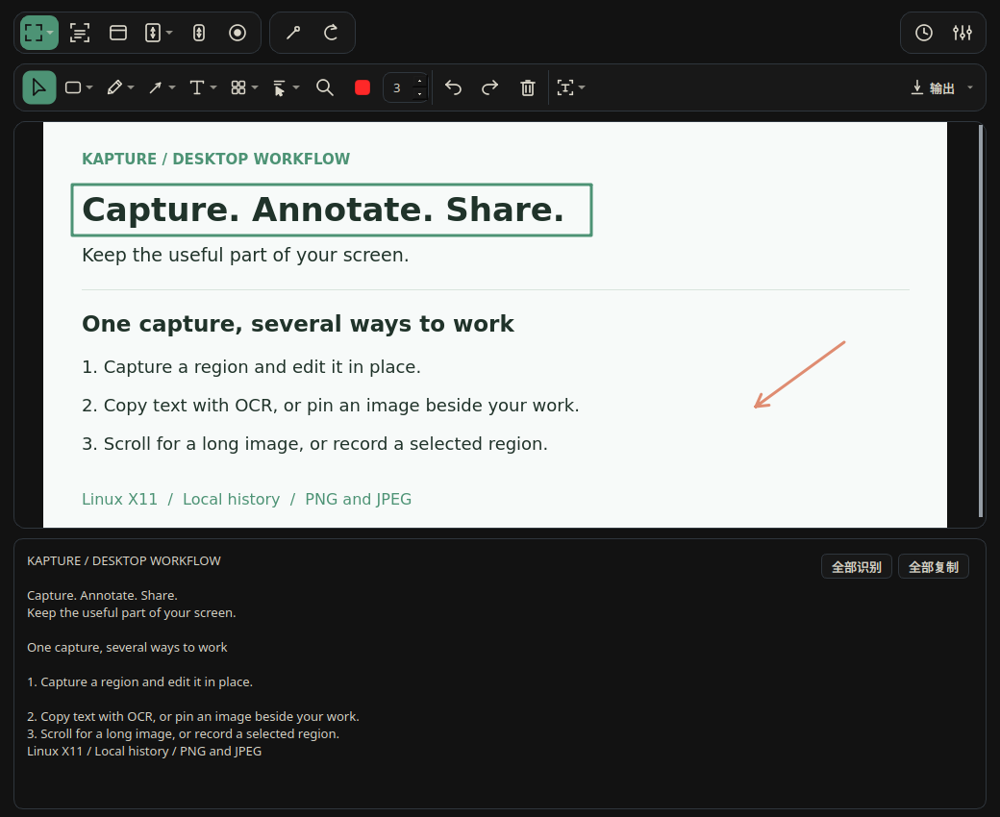
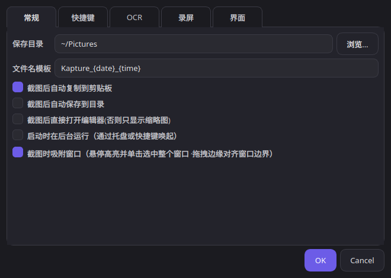

<div align="center">


# Kapture Dev

**Linux 上的 PixPin 平替**

截图 · 长截图 · OCR 取词 · 钉图 · 标注 · 录屏

面向 Linux X11，把截图、提取文字和贴图参考放进同一个工作流。

[English](README.md) · [快速开始](#快速开始) · [功能](#功能) · [反馈问题](https://github.com/CyberAn-Dev/kapture-dev/issues)


[](LICENSE)

</div>

<div align="center">



<sub>当前编辑器：演示内容、图片标注与 OCR 结果。</sub>

</div>

## 熟悉的截图工作流

- **截下来，标清楚**：框选或吸附窗口，添加箭头、序号和马赛克，复制分享。
- **图片里的字，直接拿走**：截图自动 OCR，也可局部取词或框选屏幕直接复制文字。
- **参考图，贴在手边**：钉住剪贴板图片，缩放、调透明度，一边看一边工作。
- **一屏不够，继续滚动**：自动或手动采集长图，上下往返不重复追加已采集内容。

## 功能

| 功能 | 说明 |
| --- | --- |
| 截图 | 蓝框八点调节，调边时显示像素放大镜；单行工具栏分组选择标注工具，原位取词、复制、保存。 |
| 滚动长截图 | 工具栏一键进入红框手动滚动；另支持自动向上/向下，实时预览并避免重复拼接。 |
| OCR | 中英文识别、截图后自动识别、编辑器局部取词、截屏取词。 |
| 钉图 | 置顶、缩放、透明度；右键进入分组标注工具栏或选词，直接拖选文字复制。 |
| 编辑导出 | 撤销/重做、移动/删除标注、修改颜色/线宽、画布内即时输入文字、双击修改；支持裁剪；“输出”菜单可保存原尺寸标注图，或美化导出背景、留白、圆角和阴影。 |
| 录屏 | 即时处理条和编辑器均切换到选区旁的录屏工具条：下拉选择帧率、分辨率、倒计时和时长，菜单内可自定义输入；结束后选择 MP4、GIF 或 MKV，支持分别导出多个版本和导出进度。 |
| 桌面集成 | GNOME 和 KDE Plasma 5 快捷键、主题、系统托盘与后台启动。 |

界面支持简体中文和英文。OCR 使用 Tesseract，录屏使用 ffmpeg。

## 快速开始

请使用 **X11** 会话。安装脚本面向使用 `apt` 的 Ubuntu 或 Kubuntu，需要联网。

### 从源码安装

```bash
git clone https://github.com/CyberAn-Dev/kapture-dev.git
cd kapture-dev
bash install.sh
./run.sh
```

脚本会安装系统依赖并添加应用菜单入口。启动器依赖源码目录，请保留该目录。

### 可选：构建 `.deb`

```bash
bash build_deb.sh 1.1.0
sudo apt install ./dist/kapture_1.1.0_all.deb
```

`1.1.0` 是示例版本号，软件包从当前源码目录构建。安装后运行 `kapture`；卸载使用 `sudo apt remove kapture`。

[上游 Releases](https://github.com/ycwei5/kapture/releases) 提供上游版本，可能不包含本 fork 的改动。

<details>
<summary>界面与设置</summary>

<div align="center">



<sub>配置快捷键、截图行为、OCR 与界面外观。</sub>

</div>

GNOME 启动时恢复已保存的快捷键，有冲突可在设置中修改。“后台启动”仅隐藏窗口，不等于登录自启。

</details>

## 常用操作

| 操作 | 按键 / 手势 |
| --- | --- |
| 钉住最近 / 上一张剪贴板图片 | Ctrl+1 / Ctrl+2（GNOME 默认，可修改） |
| 缩放 / 调整钉图透明度 | 滚轮 / Ctrl+滚轮 |
| 识别钉图文字 | O 或右键菜单 |
| 撤销 / 重做 | Ctrl+Z / Ctrl+Shift+Z |
| 删除选中标注 | Delete |
| 停止长截图 / 关闭当前钉图 | Esc |

截图后默认原位编辑；Enter 复制、Esc 取消，工具条可打开完整编辑器。设置中的“直接打开编辑器”优先；关闭这两项可恢复缩略图流程。钉图右键可选“标注 / 编辑”或“选取文字”，鼠标穿透后从托盘恢复。

需要截取 Kapture 自身时，在「设置 → 常规」勾选「截图时保留主界面显示」。

长截图的滚速位于长截图下拉菜单；截图延时位于截图菜单。录屏使用独立的倒计时和时长设置。

历史保存在本机，重启可恢复：截图最多 10 张、剪贴板图片最多 10 张；每类另有 4000 万总像素预算，最新单张始终保留。历史窗口可清空两类记录。

## 命令行

使用 `./run.sh <选项>` 执行一个操作，例如 `./run.sh --region`。

- 截图：`--region`、`--window`、`--scroll`、`--manual`、`--repeat`
- 其他：`--pin1`、`--pin2`、`--color`、`--record`、`--settings`、`--show`、`--background`

## 与 PixPin 的区别

Kapture Dev 是基于 [Kapture](https://github.com/ycwei5/kapture) 的独立开源项目，与 [PixPin](https://pixpin.cn/) 无隶属关系。“平替”指截图、长截图、OCR 与钉图等常用工作流，不代表功能完全一致。目前不提供 OCR 翻译、二维码识别或录屏音频。

- 仅支持 X11，暂不支持 Wayland。GNOME 和 KDE Plasma 5 支持在应用内设置全局快捷键。
- 长截图高度上限为 40,000 像素。动态页面、悬浮层、懒加载和重复内容会影响拼接；本功能不是浏览器整页导出。
- 多屏使用不同缩放比例的截图坐标尚未完整验证。
- OCR 效果受文字大小、字体和图像质量影响。需安装 Tesseract 及中英文语言包。

## 贡献与许可证

问题和改进建议请提交到 [Issues](https://github.com/CyberAn-Dev/kapture-dev/issues)，代码贡献请使用 [Pull Requests](https://github.com/CyberAn-Dev/kapture-dev/pulls)。

本项目基于 [ycwei5/kapture](https://github.com/ycwei5/kapture)；MIT 许可证及上游版权信息见 [LICENSE](LICENSE)。主题配色参考 [One Dark Pro](https://github.com/Binaryify/OneDark-Pro) 与 [Vitesse](https://github.com/antfu/vscode-theme-vitesse)。
